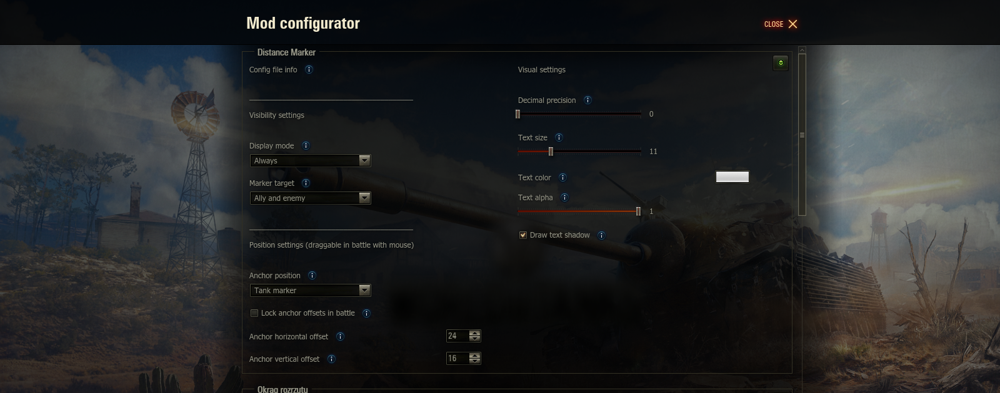

## DistanceMarker
A mod displaying customizable marker with a distance.

Features:
* draggable with mouse during battle (holding CTRL button)
* customizable text color and shadow, position, distance precision
* displaying either for all tanks or only enemies

Configurable using Mod Configurator by IzeBerg
**using "<>" button in right-bottom corner in the garage**.

## Download sites
Here are websites, where mod is uploaded directly by me:
* [WG Mods](https://wgmods.net/6662/)
* [CurseForge](https://www.curseforge.com/worldoftanks/wot-mods/distance-marker)
* [GitHub release page](https://github.com/Pruszko/DistanceMarker/releases)

## Installation
Copy "DistanceMarker_X.wotmod" and other "*.wotmod" files extracted
from downloaded zip into "[WoT game directory]/mods/[version]/" directory

Config file location:  
* [WoT game directory]/mods/configs/DistanceMarker/config.json

## Contributions
Thanks to:
* IzeBerg - for cool GUI configuration API
* POLIROID - for ModsListAPI